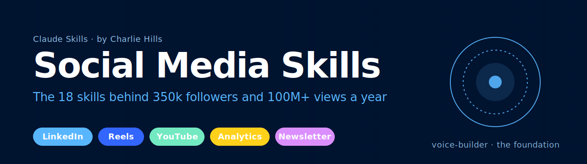

<p align="center">
  
</p>

# Social Media Skills for AI Agents

The complete set of Claude skills behind Charlie Hills' content system. 350k+ followers across LinkedIn, Instagram, Substack, X and YouTube. 100m+ views per year. All running through one system that starts with the newsletter and flows out to every other channel.

Built by [Charlie Hills](https://charliehills.substack.com). Subscribe to the [MarTech AI newsletter](https://charliehills.substack.com) for weekly breakdowns of how this system works in practice.

**Contributions welcome.** Found a way to improve a skill? [Open a PR](https://github.com/charlie947/social-media-skills/pulls). Run into a problem? [Open an issue](https://github.com/charlie947/social-media-skills/issues).

## What are Skills?

Skills are markdown files that give AI agents specialised knowledge and workflows for specific tasks. When you install these in your project, Claude recognises when you're working on a social media task and applies the right patterns, voice rules, and platform constraints.

## How Skills Work Together

Every skill reads shared context. The `voice-builder` skill is the foundation. Every other skill checks it first (via `about-me.md` and `voice.md`) before drafting a line.

```
                    ┌──────────────────────────────────────┐
                    │           voice-builder              │
                    │   about-me.md + voice.md             │
                    │   (read by every skill below)        │
                    └──────────────────┬───────────────────┘
                                       │
                    ┌──────────────────▼───────────────────┐
                    │         newsletter-voice             │
                    │   newsletter-voice.md                │
                    │   (the source every piece comes from)│
                    └──────────────────┬───────────────────┘
                                       │
     ┌────────────┬────────────┬───────┴───────┬────────────┬────────────┐
     ▼            ▼            ▼               ▼            ▼            ▼
┌──────────┐ ┌──────────┐ ┌──────────┐ ┌──────────────┐ ┌──────────┐ ┌──────────┐
│ Profile  │ │LinkedIn  │ │ Video    │ │ Analytics &  │ │Community │ │Standalone│
│          │ │ posts    │ │          │ │ Scoring      │ │          │ │          │
├──────────┤ ├──────────┤ ├──────────┤ ├──────────────┤ ├──────────┤ ├──────────┤
│profile-  │ │post-     │ │reels-    │ │post-scorer   │ │pinned-   │ │hook-gen  │
│ optimizer│ │ writer   │ │ scripting│ │              │ │ comment  │ │content-  │
│          │ │graphic-  │ │youtube-  │ │analytics-    │ │          │ │ matrix   │
│          │ │ designer │ │ thumbnail│ │ dashboard    │ │          │ │perplexity│
│          │ │infogr-gen│ │          │ │              │ │          │ │ -research│
│          │ │post-form │ │          │ │              │ │          │ │gemini-*  │
│          │ │          │ │          │ │              │ │          │ │quote-post│
└──────────┘ └──────────┘ └──────────┘ └──────────────┘ └──────────┘ └──────────┘
```

See each skill's `SKILL.md` for trigger phrases, inputs, and dependencies.

## Available Skills

<!-- SKILLS:START -->
| Skill | Description |
|---|---|
| [voice-builder](skills/voice-builder/) | Build `about-me.md` and `voice.md` from an interview plus 3 to 5 writing samples. The foundation every other skill reads. |
| [newsletter-voice](skills/newsletter-voice/) | Add newsletter-specific writing instructions on top of voice-builder. Produces `newsletter-voice.md`. |
| [profile-optimizer](skills/profile-optimizer/) | Rebuild a LinkedIn profile for conversions. Headline, about, experience, featured section, plus 4 image generation prompts. |
| [post-writer](skills/post-writer/) | Draft LinkedIn posts in your voice using the voice files. |
| [graphic-designer](skills/graphic-designer/) | Pick between HTML/CSS graphic and AI-generated infographic based on the post content. |
| [infographic-generator](skills/infographic-generator/) | The full Claude Code infographic workflow with templates, brand rules, and layout guides. |
| [post-scorer](skills/post-scorer/) | Pull your post history via Apify and score any draft against what actually performs for you. |
| [reels-scripting](skills/reels-scripting/) | Reverse-engineer an outlier Reel via Apify + Gemini 2.5 Flash. Write a new script in your voice from your newsletter. |
| [youtube-thumbnail](skills/youtube-thumbnail/) | Turn a video title into a branded YouTube thumbnail prompt for Gemini. |
| [pinned-comment](skills/pinned-comment/) | Meme-style pinned comments with a matching image generation prompt. |
| [hook-generator](skills/hook-generator/) | 6 clickbait-style two-line hook variations per topic. |
| [post-formatter](skills/post-formatter/) | Topic to ready-to-publish post using PAS, AIDA, BAB, STAR, or SLAY. |
| [content-matrix](skills/content-matrix/) | Pair your pillars with 8 formats for 32+ post ideas in one table. Justin Welsh style. |
| [perplexity-research](skills/perplexity-research/) | Surface the 20 most relevant stories in your niche from the last 7 days. |
| [gemini-infographic](skills/gemini-infographic/) | The whiteboard style that pulled 480k impressions from 3 posts. |
| [gemini-carousel](skills/gemini-carousel/) | Slide-by-slide carousel generator with an approval gate. |
| [quote-post](skills/quote-post/) | Claude writes the quote, Gemini recreates the image with the quote baked in. |
| [analytics-dashboard](skills/analytics-dashboard/) | LinkedIn Analytics export to interactive React dashboard plus 5 data-backed recommendations. |
<!-- SKILLS:END -->

## Installation

### Option 1: Claude Code plugin marketplace

```bash
# Add the marketplace
/plugin marketplace add charlie947/social-media-skills

# Install the plugin
/plugin install social-media-skills
```

### Option 2: Clone and copy

```bash
git clone https://github.com/charlie947/social-media-skills.git
cp -r social-media-skills/skills/* ~/.claude/skills/
```

### Option 3: Individual skill upload (Claude Desktop)

Download any skill folder, zip it, and upload via Customise skills in Claude.

```bash
cd social-media-skills/skills
zip -r voice-builder.skill voice-builder
# Upload voice-builder.skill through Customise skills in the Claude app
```

### Option 4: Git submodule

```bash
git submodule add https://github.com/charlie947/social-media-skills.git .agents/social-media-skills
```

Then reference skills from `.agents/social-media-skills/skills/`.

### Option 5: Fork and customise

Fork the repo, swap the voice rules for your own, and clone your fork into your projects.

## Usage

Run `voice-builder` first. Every other skill needs `about-me.md` and `voice.md` to work properly.

Once installed, ask Claude to help with content tasks and it will pick the right skill:

```
"Build my voice" → voice-builder
"Write me a post about AI agents" → post-writer
"Score this draft against my history" → post-scorer
"Make me a carousel from this" → gemini-carousel
"What should I post this week" → perplexity-research or content-matrix
"Turn this outlier Reel into a script" → reels-scripting
"I need a thumbnail for 'How I fired my team'" → youtube-thumbnail
"Write me a pinned comment" → pinned-comment
```

## Skill Categories

### Voice foundation
- `voice-builder` — interview + sample analysis, writes about-me.md and voice.md
- `newsletter-voice` — newsletter-specific writing rules on top of voice-builder

### LinkedIn
- `profile-optimizer` — full profile rebuild
- `post-writer` — drafts in your voice
- `graphic-designer` — HTML/CSS graphic or AI infographic, auto-selected
- `infographic-generator` — Claude Code infographic workflow
- `post-formatter` — topic to post via named framework (PAS, AIDA, BAB, STAR, SLAY)
- `hook-generator` — 6 hook variations per topic
- `post-scorer` — scores drafts against your post history
- `content-matrix` — pillars x formats ideation
- `perplexity-research` — 7-day niche research
- `gemini-infographic` — whiteboard style for Gemini
- `gemini-carousel` — slide-by-slide carousel
- `quote-post` — two-step quote workflow

### Instagram Reels
- `reels-scripting` — Apify + Gemini 2.5 Flash reference analysis, newsletter-aligned script

### YouTube
- `youtube-thumbnail` — title to Gemini thumbnail prompt

### Community
- `pinned-comment` — meme-style pin + image prompt

### Analytics
- `analytics-dashboard` — LinkedIn export to dashboard + 5 recommendations

## Prerequisites

A few skills need external services. Set these environment variables before use:

| Variable | Needed for |
|---|---|
| `APIFY_API_TOKEN` | post-scorer, reels-scripting |
| `GOOGLE_AI_API_KEY` | reels-scripting (Gemini 2.5 Flash video analysis) |

Set them with:

```bash
export APIFY_API_TOKEN=your_token
export GOOGLE_AI_API_KEY=your_key
```

The image generation skills (`gemini-infographic`, `gemini-carousel`, `quote-post`, `youtube-thumbnail`, `profile-optimizer`) output ready-to-paste prompts. You run them in a separate Gemini chat with Create Image enabled. No API key needed.

## Contributing

PRs and issues welcome. See [CONTRIBUTING.md](CONTRIBUTING.md) for guidelines on adding or improving skills.

Run `./validate-skills.sh` before submitting to check your skill against the spec.

## License

[MIT](LICENSE). Use these however you like. If they help you, a link back to the [newsletter](https://charliehills.substack.com) is appreciated.

— Charlie
